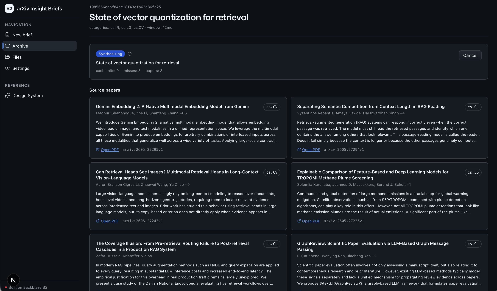

<!-- last_verified: 2026-05-26 -->
# arXiv Insight Briefs

A research-brief generator for prospects and engineers exploring **[Backblaze B2](https://www.backblaze.com/sign-up/ai-cloud-storage?utm_source=github&utm_medium=referral&utm_campaign=ai_artifacts&utm_content=arxiv-insight-briefs)** as the storage backbone for an AI workflow. You type a research question in plain English; the app routes it to arxiv categories, ranks the most recent abstracts, downloads the surviving PDFs into a content-addressed B2 cache, extracts the meaningful sections with PyMuPDF, and asks Nemotron (free on `build.nvidia.com`) for a *problem-anchored* brief — key findings, contradictions, maturity assessment, recommendations for the reader, open questions — with every claim citing a presigned link to the source PDF in your bucket.

The point of the sample isn't summarization. It's the **B2-as-archive shape**: every brief, every cached PDF, and every extracted-text artifact lives in one bucket, fronted by S3 (`boto3`). The bucket is the database.



## What you get

- **NL question → arxiv routing.** One Nemotron call resolves "latest research on sending files over the internet" into `{categories: ["cs.NI"], keywords: ["quic", "bbr", "tcp"], time_window_months: 12}`. Hallucinated categories are dropped against a bundled taxonomy. Falls back to keyword search if the LLM is unavailable.
- **Abstract-first ranking.** A batched Nemotron call scores all candidate abstracts; only the top ~8 survive to full-text extraction. This is the cost lever — abstract calls are cheap, full-text calls are not.
- **B2 content-addressed cache.** `HeadObject` before any arxiv re-fetch and before any PyMuPDF re-pass. Cache hits/misses exported on `/metrics`. The same paper across overlapping queries costs nothing.
- **Section-aware extraction.** PyMuPDF keeps abstract + intro + methods + conclusion, drops references and appendices, and hard-caps each paper at `MAX_PAPER_CHARS`.
- **Problem-anchored synthesis.** A single Nemotron call produces a markdown brief with structured sections and `[arxiv:ID]` citations. The runtime layer rewrites those to short-lived presigned PDF links before shipping markdown to the UI.
- **B2 as the archive.** Every brief lives at `briefs/{id}/brief.md` + `manifest.json`. `/briefings` is just `ListObjectsV2`.
- **File browser.** `/files` surfaces everything under the sample's B2 prefix — papers cache, brief archives, manifests — with download and delete. Unguarded by design (deleting a cached PDF just costs a re-fetch next time).

## Pipeline

```
question ─▶ topic_router ──▶ arxiv_search ──▶ abstract_ranker
                                                    │
                       ┌────────────────────────────┘
                       ▼
              pdf_pipeline (B2 cache hit? skip; else fetch + put_object)
                       │
                       ▼
                  synthesis ──▶ brief.md + manifest.json in B2
```

Three Nemotron calls per brief. One PyMuPDF pass per *new* paper. No embeddings, no vector DB, no GPU.

## Object layout in B2

```
b2://{B2_BUCKET_NAME}/arxiv-insight-briefs/
  papers/
    {arxiv_id}.pdf            # content-addressed PDF cache (shared across briefs)
    {arxiv_id}.txt            # section-trimmed extracted text cache
  briefs/
    {brief_id}/
      query.json              # NL question + LLM-resolved categories/keywords
      manifest.json           # schema-versioned: ranked papers, paths, status, timings
      brief.md                # generated insight briefing (markdown)
```

## Quick start

You need: Node.js >= 20, pnpm >= 9, Python >= 3.11, a free [Backblaze B2 account](https://www.backblaze.com/sign-up/ai-cloud-storage?utm_source=github&utm_medium=referral&utm_campaign=ai_artifacts&utm_content=arxiv-insight-briefs), and (optional but recommended) a free [NVIDIA Build](https://build.nvidia.com) API key.

```bash
git clone https://github.com/backblaze-b2-samples/arxiv-insight-briefs.git
cd arxiv-insight-briefs

pnpm install

cd services/api && python -m venv .venv && source .venv/bin/activate
pip install -r requirements.txt
cd ../..

cp .env.example .env  # fill in B2 + NVIDIA values
pnpm dev
```

Frontend at `localhost:3000`, API at `localhost:8000`. `pnpm dev` runs `pnpm doctor` first — a preflight check that catches the common setup gotchas (wrong Node/Python version, missing venv, missing or placeholder `.env`, ports already taken).

### Required env vars

```
B2_ENDPOINT=https://s3.<region>.backblazeb2.com
B2_REGION=<region>           # e.g. us-west-004
B2_KEY_ID=
B2_APPLICATION_KEY=
B2_BUCKET_NAME=
```

NVIDIA settings (optional — pipeline gracefully degrades when missing):

```
NVIDIA_API_KEY=
NVIDIA_NEMOTRON_MODEL=mistralai/mistral-nemotron
NVIDIA_BASE_URL=https://integrate.api.nvidia.com/v1
```

Tuning (all optional):

```
ARXIV_CANDIDATE_LIMIT=50
BRIEF_PAPER_LIMIT=8
BRIEF_TIME_WINDOW_MONTHS=12
MAX_BRIEFS_IN_FLIGHT=2
MAX_PAPER_CHARS=12000
```

## Graceful degradation

Designed for the failure modes you'll actually hit:

- **No NVIDIA key.** Router + synthesis stages skip. Brief status becomes `done_no_analysis`. The arxiv candidates and any cached PDFs still archive to B2 — the storage half of the sample is fully usable with B2 credentials alone.
- **arxiv returns nothing.** Brief status `done_no_results` with a friendly skeleton brief; no crash, no retry storm.
- **A paper's PDF fetch or extraction fails.** Recorded per-paper in the manifest; synthesis runs against whatever survived. Brief surfaces an "N of M papers" annotation.
- **Nemotron rate-limited or 5xx.** `tenacity` retries up to 3x with exponential backoff. Persistent failure routes through the fallback paths above — never crashes the pipeline.
- **Prompt injection from a paper.** Abstracts and PDF text are treated as untrusted content; system prompts explicitly instruct the model to ignore embedded instructions. See [docs/SECURITY.md](docs/SECURITY.md).
- **Cancellation.** `DELETE /briefings/{id}?mode=cancel` flips the manifest's `cancel_requested` flag; the pipeline checks between stages. An in-flight HTTP read won't die immediately.

## Limitations (deliberate v1 scope)

- No single-paper Q&A or chat interface.
- No embeddings, vector DB, or RAG-over-corpus — the cost lever is abstract-first ranking.
- Single-user; no auth, no sharing, no multi-tenant isolation.
- PyMuPDF is **AGPL-licensed**. If you build a commercial product from this scaffold, either secure a PyMuPDF commercial license or swap to a permissive PDF extractor (`pypdfium2`, `pdfminer.six`). The repo layer's `pdf_extractor.py` is the only place to change.
- No background re-queue of orphaned briefs after API restart — the manifest accurately records the last completed stage but doesn't auto-resume.

## Commands

| Command | What it does |
|---------|-------------|
| `pnpm dev` | Start frontend + backend (runs `pnpm doctor` preflight) |
| `pnpm dev:web` | Frontend only |
| `pnpm dev:api` | Backend only |
| `pnpm build` | Build frontend |
| `pnpm lint` | Lint frontend |
| `pnpm lint:api` | Lint backend (ruff) |
| `pnpm test:api` | Run backend tests (offline, fakes for LLM + arxiv + B2) |
| `pnpm check:structure` | Verify layering rules |

## Documentation

| Doc | Purpose |
|-----|---------|
| [AGENTS.md](AGENTS.md) | Agent table of contents — start here |
| [ARCHITECTURE.md](ARCHITECTURE.md) | System layout, layering, data flows |
| [docs/features/topic-routing.md](docs/features/topic-routing.md) | LLM-as-router contract |
| [docs/features/paper-discovery.md](docs/features/paper-discovery.md) | arxiv search + abstract ranking |
| [docs/features/pdf-pipeline.md](docs/features/pdf-pipeline.md) | B2 cache + PyMuPDF extraction |
| [docs/features/insight-synthesis.md](docs/features/insight-synthesis.md) | Synthesis prompt + citation mapping |
| [docs/features/briefing-archive.md](docs/features/briefing-archive.md) | `ListObjectsV2`-backed archive |
| [docs/app-workflows.md](docs/app-workflows.md) | User journeys |
| [docs/dev-workflows.md](docs/dev-workflows.md) | Engineering + testing |
| [docs/SECURITY.md](docs/SECURITY.md) | Security principles |
| [docs/RELIABILITY.md](docs/RELIABILITY.md) | Reliability expectations |

## License

MIT — see [LICENSE](LICENSE). Note that PyMuPDF (a runtime dependency) is AGPL; see the Limitations section above.

## Claude Agent B2 Skill

Manage Backblaze B2 from your terminal using natural language. Useful when iterating on this sample: list briefs, inspect manifests, prune the `papers/` cache.

Repo: [https://github.com/backblaze-b2-samples/claude-skill-b2-cloud-storage](https://github.com/backblaze-b2-samples/claude-skill-b2-cloud-storage)
